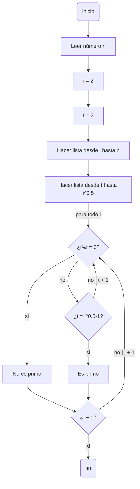
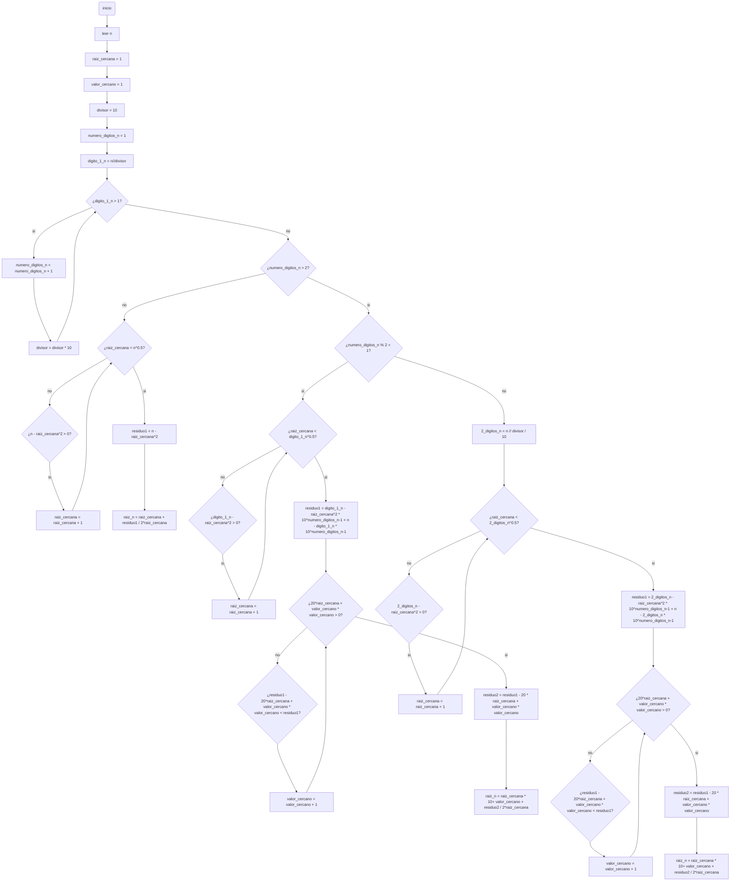

# pdc_reto_3
A continuacion, se mostrara el pseudocodigo y diagrama de flujo de los problemas planteados para este reto
## Numeros primos hasta un natural n (pseudocodigo)
```pseudocode
[Variables]
n : entero 
i : entero
t : entero
Inicio
    i := 2
    t := 2
    Leer n
    Para (i hasta n) hacer
        Para (t hasta i^0.5) hacer
            Mientras (t < i^0.5) hacer
                Si modulo (i,t) == 0 entonces
                    Hay_divisor := verdadero
                    Fin si
                Sino 
                    Si t == (i^0.5)-1 entonces
                        Hay_divisor := falso
                    Sino
                        t = t + 1
                    Fin si
                Fin si
            Fin mientras
        Fin para
        Si Hay_divisor == verdadero entonces
            escribir(i "no es numero primo") 
        Sino
            escribir(i "es numero primo")
        FIn si
    Fin Para
Fin
```
## Numeros primos hasta un natural n (diagrama de flujo / flujograma)

## Raiz cuadrada de un numero n (pseudocodigo)
```pseudocode
[Variables]
n : entero
raiz_cercana : entero
valor_cercano : entero
divisor : entero
numero_digitos_n : entero
digito_1_n : entero
residuo1 : entero
residuo2 : entero
raiz_n : entero
2_digitos_n : entero
Inicio
    raiz_cercana := 1
    valor_cercano := 1
    divisor := 10
    numero_digitos_n := 1
    leer n
    digito_1_n := n // divisor
    Mientras ( digito_1_n > 1) hacer
        numero_digitos_n = numero_digitos_n + 1
        divisor := divisor * 10
    Fin mientras
    Si numero_digitos_n > 2 entonces
        Si modulo (numero_digitos_n, 2) = 1 entonces
            Mientras (raiz_cercana < (digito_1_n^0.5)) hacer
                Si ((digito_1_n - (raiz_cercana^2)) > 0) entonces
                    raiz_cercana = raiz_cercana + 1
                Finsi
            Fin mientras
            residuo1 := (digito_1_n - (raiz_cercana^2)) * 10^(numero_digitos_n-1) + (n - (digito_1_n * 10 ^(numero_digitos_n-1)))
            Mientras ((((20*raiz_cercana)+valor_cercano)*valor_cercano) < residuo1) entonces
                Si (residuo1 - (((20*raiz_cercana)+valor_cercano)*valor_cercano) > 0) entonces
                    valor_cercano = valor_cercano + 1
                Fin si
            Fin mientras
            residuo2 := residuo1 - (((20*raiz_cercana)+valor_cercano)*valor_cercano)
            raiz_n = ((raiz_cercana * 10)+ valor_cercano) + (residuo2 / 2*raiz_cercana)
        Sino
            2_digitos_n := n // (divisor / 10)
            Mientras (raiz_cercana < (2_digitos_n^0.5)) hacer
                Si ((2_digitos_n - (raiz_cercana^2)) > 0) entonces
                    raiz_cercana = raiz_cercana + 1
                Finsi
            Fin mientras
            residuo1 := (2_digitos_n - (raiz_cercana^2)) * 10^(numero_digitos_n-1) + (n - (2_digitos_n * 10 ^(numero_digitos_n-1)))
            Mientras ((((20*raiz_cercana)+valor_cercano)*valor_cercano) < residuo1) entonces
                Si (residuo1 - (((20*raiz_cercana)+valor_cercano)*valor_cercano)) > 0 entonces
                    valor_cercano = valor_cercano + 1
                Fin si
            Fin mientras
            residuo2 := residuo1 - (((20*raiz_cercana)+valor_cercano)*valor_cercano)
            raiz_n = ((raiz_cercana * 10)+ valor_cercano) + (residuo2 / 2*raiz_cercana)
        Fin si
        Fin mientras
    Sino
        Mientras (raiz_cercana < (n^0.5)) hacer
                    Si ((n - (raiz_cercana^2)) > 0) entonces
                        raiz_cercana = raiz_cercana + 1
                    Finsi
        Fin mientras
        residuo1 := (n - (raiz_cercana^2))
        raiz_n := raiz_cercana + (residuo1 / 2*raiz_cercana)
    Fin si
    escribir("La raiz de " n " es aproximadamente " raiz_n)
Fin
```
## Raiz cuadrada de un numero n (diagrama de flujo / flujograma)

